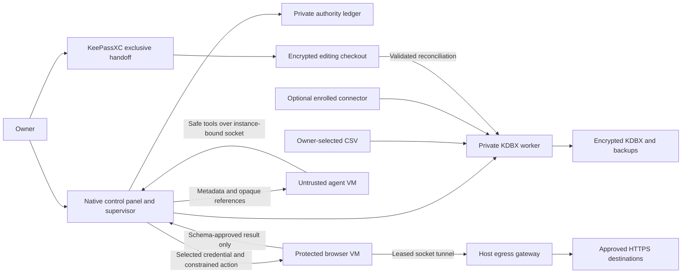
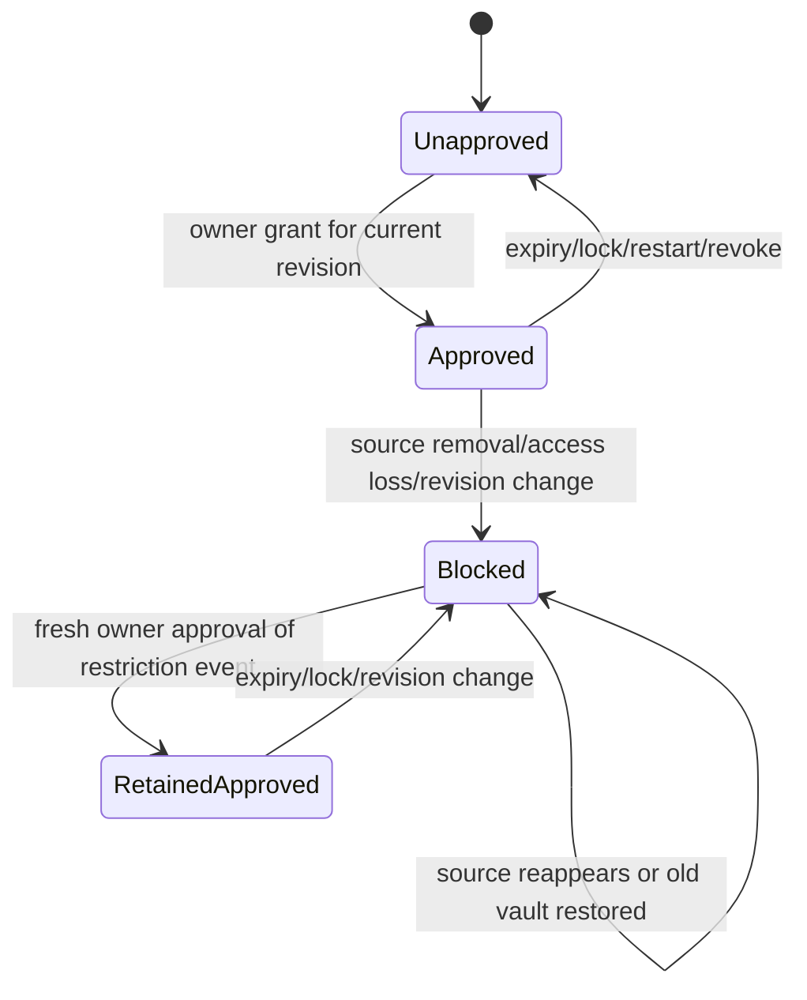
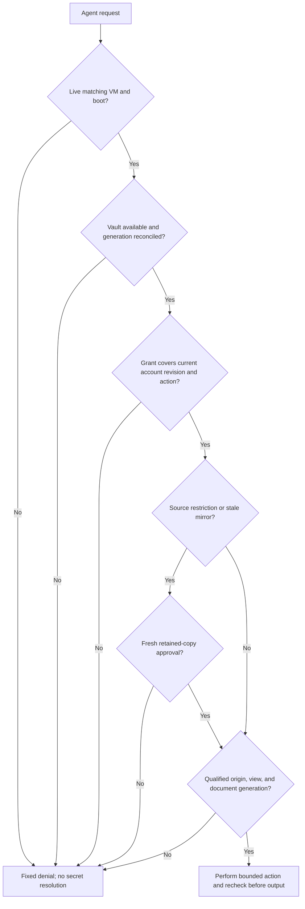

# Standalone Agent Credential Vault - Plan

## Goal Capsule

**Objective:** The owner can import and manage credentials locally, then let an agent find an account, log in, and perform supported website tasks without putting the credentials into the agent's conversation or execution environment.

**Means:** A standalone KDBX vault, native owner controls, an isolated agent runtime, and a separate protected browser runtime (KTD1–KTD4). Apple ingestion is an optional, separately delivered connector (KTD8).

**Authority:** Current user instructions → Product Contract here → Planning Contract here → implementation units. The older Apple-broker plan supplies historical context, not conflicting requirements. The versioned connector contract owns the ingestion wire semantics.

**Execution profile:** Deep, security-sensitive, local personal application for this owner's Apple Silicon Mac. Implement in a new sibling repository named `agent-credential-vault`. This planning package remains in the Apple project until the executing agent copies the plan and connector contract into the new repository and records their origin. All proposed source/test paths below are relative to that new repository; existing-evidence paths are explicitly identified as belonging to the Apple project.

**Ownership:** The next implementation agent owns this plan through tested packaging and an owner rollout checkpoint. The current Apple project and its probe belong to the separate connector track. No Apple automation is a prerequisite for the standalone release.

**Landing strategy:** Local implementation and review first; keep progress outside this plan. No remote, PR publication, real-password import, or production account test is authorized merely by this planning handoff. Obtain the owner's explicit rollout approval after the release gates pass.

**Stop conditions:** Stop the affected work if the specified KDBX profile cannot round-trip safely, the agent cannot run within the isolation boundary, or a protected-browser escape/output test fails. Preserve diagnostic evidence containing only synthetic data. Do not substitute an unrestricted same-user deployment or relax the secrecy contract to claim completion. Independent units may continue with synthetic fixtures.

## Product Contract

### Summary

Build the agent-facing password app independently of Apple Passwords. Its encrypted local store is usable through CSV import and owner editing in KeePassXC. An optional connector can later mirror groups, account metadata, and passwords into the same store. Deleting a source item preserves the local copy but removes its standing permission for agent use.

### Problem Frame

An agent needs account selection and authenticated browsing, not knowledge of a password. A variable containing a password is insufficient protection: its value can escape through tool arguments, traces, browser inspection, screenshots, or the agent's shell. The app must mediate the action and the resulting observations, not merely redact its normal responses.

The owner accepts a local encrypted copy rather than Apple remaining the sole credential authority. A native control panel is needed for unlock, permissions, import, and failure recovery. A second full password-manager editor is not needed.

### Requirements

R1. **Standalone operation.** With no Apple account, connector, or Apple permissions configured, the owner can create a vault, import CSV, inspect/edit it, grant access, and complete a supported agent login and subsequent task.

R2. **Portable encrypted storage.** Store retained credentials in an owner-recoverable KDBX file readable by a qualified KeePassXC version. Use established cryptography and an owner-held master password; the app must not make recovery depend on its policy database or the Apple connector.

R3. **Owner import.** Import Apple-style and mapped generic CSV through a local owner interface. Passwords, notes, and other secret columns never enter agent tools, model inputs, diagnostic output, or plaintext intermediary files. Explain that the selected source CSV is already plaintext and is outside the encrypted vault's protection.

R4. **Searchable catalog.** An authorized agent can search by website, title/name, and username. Return bounded account metadata, group/provenance state, and opaque references. Metadata is intentionally visible to the agent and may enter its conversation/history; passwords and secret-bearing fields are not metadata.

R5. **Secret non-disclosure.** Passwords, TOTP seeds/codes, recovery codes, vault keys, authenticated cookies, bearer tokens, and comparable protected values must not appear in agent-readable memory/files, tool inputs/results, conversation context, logs, traces, screenshots, clipboard, or telemetry produced by this app. Plaintext necessarily exists temporarily in trusted memory and at the destination service. Human password viewing in KeePassXC is an explicit owner-only operation.

R6. **Enforced isolation.** An agent with arbitrary code execution inside its approved runtime cannot read the host vault, keys, trusted-process memory, owner UI, browser profile, automation control channel, or other agents' sessions. An unrestricted agent running under the owner's macOS login is outside the supported deployment.

R7. **Authority before use.** A native owner grant binds agent identity, account revision, exact destination origins, supported actions, and expiry. Agent requests and imported data cannot create grants. Authentication is not permission for arbitrary account-changing actions.

R8. **Atomic protected authentication.** The agent supplies an account reference, not a password variable. The trusted runtime resolves, fills, submits, and verifies the login while observations are closed. Return only a typed outcome and protected session reference. No raw get/reveal/copy/export/clipboard/evaluate capability is available to the agent.

R9. **Protected post-login work.** Provide approved navigation, observation, extraction, and nonsecret form actions within that same protected runtime. Do not transfer cookies or the session to ordinary browser/crawling tools. Unsupported pages and sensitive account routes fail closed.

R10. **Honest site capability.** Publish which site adapters and actions are qualified. Do not claim universal support or absolute protection against a compromised destination, host administrator, kernel, or arbitrary transformed secret echoes from a hostile website. Unknown flows require owner intervention or an adapter change, not a less-protected fallback.

R11. **Retain source removals.** Never automatically erase a local credential because an upstream item/group disappears. Preserve its current secret, source/group provenance, and a dated, human-readable removal annotation. Source removal invalidates its agent authority and sessions; fresh owner approval is required for further agent use.

R12. **Distinguish uncertainty.** Permission loss, missing coverage, connector failure, and confirmed deletion are different states. A partial or failed scan cannot prove deletion. Retain affected entries and expose accurate status; authority restrictions must survive source reappearance and vault restoration.

R13. **Deterministic ingestion.** Source updates are idempotent, bounded, and identified independently of names. Preserve owner edits through explicit conflicts. Never infer identity solely from matching website/username/title, or infer deletions from missing CSV rows.

R14. **Owner controls.** Provide native controls for create/unlock/lock, CSV mapping/commit, catalog and source status, consent/revocation, retained-item approval, conflicts, backup/restore, and exclusive KeePassXC inspection/editing. Secret reveal/editing belongs to KeePassXC, not the agent API.

R15. **Lifecycle safety.** Lock, screen lock, sleep, quit, crash, grant expiry, policy change, and credential changes close or invalidate affected capabilities. Requests have explicit operation IDs, cancellation, and safe retry semantics; interrupted authentication is never blindly replayed.

R16. **Recoverable persistence.** Interrupted writes preserve a decryptable previous generation. Encrypted backups and restore drills are part of the product. Restoring an older file cannot restore old agent authority. No automatic purge of retained credentials or their last recoverable copy.

R17. **Local-only secret path.** Vault import, secret resolution, and browsing run locally. Secrets go only to the explicitly authorized website/identity provider over authenticated HTTPS. No cloud browser, hosted crawler, cloud vault service, or remote diagnostic upload receives them.

R18. **Agent interface parity.** CLI, MCP tools, and programmatic tool calling (PTC) expose the same safe domain operations and result schemas. Native consent/unlock, selecting a plaintext import file, password reveal, and policy modification remain deliberately human-only.

R19. **Independent connector.** The standalone app owns a versioned private ingestion interface and fake-source conformance tests. Apple collection, scheduling internals, and its live test program remain in the connector project. The app can request a configured refresh but cannot force disclosure or bypass Apple owner interaction.

R20. **Production evidence.** Real credentials are prohibited until isolation, persistence, output leakage, recovery, dependency compatibility, and end-to-end tests pass on the packaged target machine. A working demo or passing unit tests alone is insufficient.

### Actors

A1. Owner: trusted human controlling vault unlock, import, grants, recovery, and KeePassXC.

A2. Agent: untrusted caller, including its model-generated code and prompt-injected instructions; confined to its runtime.

A3. Broker and protected browser: trusted software with narrowly separated policy, storage, and website access responsibilities.

A4. Optional source connector: owner-enrolled trusted secret ingestion producer, not a policy authority.

A5. Website: approved credential destination but untrusted page content. A compromised approved service is outside the non-disclosure guarantee described in R10.

### Key Flows

F1. Owner creates and unlocks a vault → selects CSV → reviews metadata/mapping/counts → commits → searches the standalone catalog.

F2. Agent requests catalog visibility → owner approves disclosure scope → agent searches and selects an account reference → requests account use → owner approves exact scope → broker authenticates → agent performs an allowed task through safe observations → session closes.

F3. Owner selects Open in KeePassXC → broker ends sessions and creates an encrypted editing checkout → owner views/edits → owner closes the editor and resumes the app → changed credentials/policy dependencies are reconciled before access resumes.

F4. Connector ingests a complete or partial update → stable identities update groups/entries → conflicts are held for owner review → only established removals receive deletion annotations → retained items require renewed authority.

F5. Owner reviews a retained item and its removal history → explicitly approves a local retained copy for specified use → bounded agent access resumes without claiming the upstream item exists again.

F6. Lock/crash/restore interrupts activity → all capabilities close → broker recovers a valid encrypted generation → owner unlocks and grants access anew.

### Acceptance Examples

AE1. On a machine with Apple integration absent, a synthetic CSV account can be found by all three R4 search modes, used on a qualified test website, and used to read one allowed post-login page. The synthetic password is absent from captured agent inputs/outputs and application artifacts.

AE2. An agent stores `account_ref` and `session_ref` in PTC variables, completes F2, and cannot convert either reference into a password, cookie, path, or browser debugging address.

AE3. A connector confirms an item disappeared from a fully covered group. The account remains inspectable in KeePassXC, retains its group/removal history, and an old grant fails. A fresh native approval permits only the explicitly approved retained copy.

AE4. A member loses access to a shared group or a scan covers only one page. No entry is labelled deleted on that evidence; previous values remain encrypted, and affected authorization follows KTD7 rather than silently continuing.

AE5. A source rename does not create a duplicate when stable identity is available. Two accounts with identical names and usernames but different identities are never merged automatically.

AE6. A page tries to redirect a login, expose a password/token in content, open another window, or provoke raw diagnostics. Unsupported transitions close the output gate and return a fixed error; no raw page dump escapes.

AE7. Kill the broker during every persistence/authentication stage, then restart or restore an older backup. The vault is recoverable, affected sessions are dead, and retained-item blocks and revoked grants do not turn into permission.

AE8. Root inside the agent VM tries to read the host home, contact the protected browser control port, inspect its memory, request secret fields, and reach host/LAN services. Each attempt fails without exposing a synthetic canary.

### Settled Product Decisions

PD1. **Split and standalone delivery.** `session-settled: user-directed`. Governs R1, R2, R3, R19. Rejected alternative: continue to require Apple Passwords as the runtime authority for every agent use.

PD2. **Retain, annotate, and require fresh approval after source deletion.** `session-settled: user-directed`. Governs R11, R12, R16. The user selected choice 1, not automatic continued use of a deleted source credential.

PD3. **Small owner panel; KeePassXC for secret inspection.** `session-settled: user-approved`. Governs R14, R18. Rejected alternative: build a second full password-manager editor.

### Scope Boundaries

First release supports local password credentials and optional TOTP stored in the managed vault, one owner, and a bounded set of qualified website adapters. The synthetic test adapter is mandatory; production qualification starts with an owner-selected low-risk site. CSV alone may not contain passkeys, shared-group structure, or all Apple credential types; do not manufacture missing information.

Excluded: Apple write-back, general browser extensions, cloud synchronization, multi-owner sharing/ACL replication, passkey custody, arbitrary recovery-code retrieval, agent password editing/export/deletion, and universal remote crawler compatibility. KDBX provenance groups do not recreate Apple's sharing permissions. Future types remain disabled until separately specified and tested.

### Deferred to Follow-Up Work

Apple extraction and its live owner/member/sync qualification remain in the separate connector project. Connecting that producer to this app follows the consumer's conformance suite; it is not required for standalone delivery.

## Planning Contract

### Context and Research

The existing Apple project has a Swift role-only accessibility probe, synthetic fixtures, and experiment records, not a production catalog reader or credential broker. Its latest recorded probe test count is 15; this planning work did not rerun tests. See its `tests/experiments/apple_probe/README.md` and `docs/research/experiments/test-status.md`.

The historical `docs/plans/2026-09-21-1502-feat-apple-credential-broker-plan.md` remains unchanged. This new plan supersedes its Apple-only authority, no-local-vault-copy, and CSV-not-sufficient rules for the standalone track. Its OS isolation, origin binding, native approval, and protected-browser principles carry forward through R5–R10. Historical R/F/AE IDs belong to that document; IDs here have their own namespace.

KDBX is an existing encrypted format, not a new crypto design. The [KDBX specification](https://keepass.info/help/kb/kdbx.html) informs the format/profile checks in KTD1. The [KeePassXC guide](https://keepassxc.org/docs/KeePassXC_GettingStarted) supports using its existing owner-facing groups, search, and editor rather than duplicating that UI.

The chosen Python library's [4.2.0 release](https://github.com/libkeepass/pykeepass/releases/tag/v4.2.0) fixes seed reuse on save. Its [pinned save implementation](https://raw.githubusercontent.com/libkeepass/pykeepass/v4.2.0/pykeepass/pykeepass.py) accepts streams and refreshes encryption seeds, but its ordinary file-path save is not the required transaction/durability protocol. KTD1/KTD5 wrap stream serialization in app-owned persistence. Its [dependency manifest](https://raw.githubusercontent.com/libkeepass/pykeepass/v4.2.0/pyproject.toml) is GPL-3.0 and has broad dependency bounds; the app needs exact locks and distribution notices. The Rust [keepass crate](https://docs.rs/keepass/latest/keepass/) describes experimental KDBX4.1 writing, so it is not selected as the authoritative writer for this release.

Apple documents separate [virtual network devices](https://developer.apple.com/documentation/virtualization/vzvirtualmachineconfiguration/networkdevices), [host/guest sockets](https://developer.apple.com/documentation/virtualization/sockets), and a [VM display view](https://developer.apple.com/documentation/virtualization/vzvirtualmachineview). These are building blocks for KTD3, not evidence that this app's containment works. U2 must prove that boundary.

Playwright documents [browser contexts](https://playwright.dev/python/docs/api/class-browsercontext) and warns that [saved authentication state can impersonate users](https://playwright.dev/python/docs/auth). Context isolation and request routing alone are not an OS/network boundary. KTD3 removes direct browser networking; KTD9 prohibits storage-state export and raw observations.

The official [MCP Python SDK](https://github.com/modelcontextprotocol/python-sdk) currently documents its v2 stable line. Select and lock a specific compatible release in U1; use [stdio transport](https://modelcontextprotocol.io/specification/2025-11-25/basic/transports) inside the agent VM. Application-level operation IDs avoid coupling safety to optional MCP task extensions.

### Key Technical Decisions

#### KTD1. Managed KDBX profile and private storage adapter

Governs R2, R3, R5, R16. Start with KDBX4.0, AES-256, Argon2id, and PyKeePass4.2.0 in a pinned Python3.12 environment. Qualify that exact profile against the installed KeePassXC release before accepting user data. Record format, KDF, library, KeePassXC, OS, and package hashes in a compatibility manifest. Do not claim arbitrary KDBX4.1 support or silently downgrade files.

For new vaults, start Argon2id at 128 MiB, three iterations, two lanes, and benchmark unlock on the target Mac; increase cost toward a one-second target without lowering that floor automatically. Bound hostile-file KDF requests before key derivation: 1 GiB memory, 20 iterations, eight lanes by default; owner review is required above those limits. The actual qualified parameters become release evidence, not a universal performance claim.

The adapter's internal API contains only the needed create/load/search-projection/transaction/resolve operations. PyKeePass and KeePassXC generic read/export commands are never agent tools. Keep passwords and notes in encrypted KDBX content, not public headers or a plaintext search index. Search indexes exist only in the vault worker's memory while unlocked. Reject unknown critical format/features before writing; retain the previous generation. Preserve supported entry history, custom fields, groups, Unicode, and TOTP attributes in round-trip tests. Attachments and unfamiliar extensions are preserved only if qualified; otherwise a managed import rejects them rather than discarding them.

This choice avoids new cryptography and a GUI dependency for every login. It does not provide guaranteed zeroization in Python. Disable core dumps and raw exceptions; use short-lived workers and terminate them on lock. FileVault is a deployment prerequisite, not a promise of forensic erasure or protection from a hostile host administrator.

#### KTD2. Native supervisor and narrow process interfaces

Governs R5–R8, R14, R15, R18. Swift6/SwiftUI owns the native panel, VM lifecycle, owner consent, policy ledger, and capability authority. A host-private Python worker owns KDBX and CSV parsing; a Python Playwright worker lives in the protected browser VM. Guest CLI/MCP/PTC packages have no storage-library dependency.

Use a release-signed supervisor and inherited private IPC channels; no general host HTTP server or discoverable secret-service socket. Launch storage workers from pinned application resources with a sanitized environment and fixed executable path. Send unlock material through private input channels, never argv, environment, shell, clipboard, or model prompts. The supervisor never returns IPC payloads as diagnostics. Apply strict size/schema checks on both sides and turn exceptions into a fixed error vocabulary before crossing a trust boundary.

Store no master password by default. Owner unlock is required after launch/lock. A convenience biometric/keychain-unlock feature is deferred; it must not silently weaken master-key custody. First release only needs native secure password entry. Separate app unlock from individual account-use approval.

#### KTD3. Two local VMs and host-enforced network capability

Governs R6, R9, R10, R17. Use Apple Virtualization for two Linux ARM64 VMs: an untrusted agent VM and a trusted browser VM. Neither has a virtual network interface or host home mount. The browser VM has no shared folders, clipboard, save-state, guest swap, core dumps, or persistent writable browser profile. A read-only qualified base image plus ephemeral memory-backed state is the default. The owner may view its screen through a native VM view for challenges; the agent cannot.

Separate host/guest socket devices and listeners by VM instance, boot nonce, and protocol role. The supervisor creates channels; guest-provided identifiers are not proof of identity. The agent gets only the public broker protocol and an explicitly configured model-provider transport. The browser gets its private execution channel and a leased egress stream. No agent-controlled forwarding between those channels is allowed.

Implement a host CONNECT gateway reached through a guest loopback proxy bridged over the VM socket. Each lease names exact permitted HTTPS host/port pairs and its browser session; default port is 443. Resolve DNS on the host, reject loopback/private/link-local/multicast/metadata destinations for IPv4 and IPv6, pin the checked addresses to that connection, and revalidate on every new connection. Reject IP literals and userinfo by default. TLS validation remains enabled in Chromium. No direct DNS/UDP/QUIC route exists without a NIC; proxy settings are not the only enforcement. Kill established tunnels when a lease expires or is revoked.

Separate credential-submission origins from necessary resource/identity-provider origins in site manifests. Granting CDN access never grants permission to fill a credential there. A malicious approved site can misuse a secret it legitimately receives; R10 limits that claim. Test HTTP/2 coalescing, WebSocket connections, redirects, popups, DNS rebinding, and authority confusion against actual pinned destinations.

The agent VM uses a separate host model relay, not the browser CONNECT gateway. The relay accepts only configured provider request paths, fixes the upstream HTTPS destination, rejects caller-supplied authorization/routing headers, and injects the owner's provider key from native host key custody. Provider credentials never enter the VM or model context. Guest clients use a loopback transport bridged to their instance-bound relay channel; rate and spend limits are owner-controlled. Relay errors/logging must not expose its key. Prove compatibility with the owner's chosen Linux-capable agent client, including streaming and tool results. The unrestricted macOS desktop agent is not transparently protected by installing MCP tools. If the chosen client cannot use this transport, stop its integration and ask for a supported client; never market same-user mode as equivalent.

A browser-side watchdog terminates execution when a short host lease stops renewing. Host gateway leases expire independently, and a supervisor monitor closes all VMs on supervisor loss. These are required crash controls, not assumptions that application cleanup always runs. Start resource qualification at two vCPUs and 4 GiB RAM per VM; adjust from measurements on the owner's machine. The alternative host-browser/Network Extension design is deferred because it adds entitlement and coverage uncertainties to this release's boundary.

#### KTD4. Capability references and interface contract

Governs R4, R7–R9, R15, R18. The agent variable is an opaque reference, not a hidden-language string containing a password. Use unpredictable 256-bit references indexed in host memory and bound to agent VM instance, boot epoch, grant, entry UUID/revision, action, and expiry. Reference lookup does not accept caller-supplied filesystem paths or KDBX selectors. References are not reusable across agent boots or owner lock cycles.

Search references expire after five minutes; access grants default to one hour and protected sessions to 15 minutes idle/one hour absolute. An owner may shorten durations. A retained-item approval defaults to one session and is bound to its removal event and current revision. A durable allow rule is not part of this first release. Each action rechecks policy, revision, lease, origin, and document generation before execution and again before output.

First use has two distinct grants. A catalog-disclosure request needs no account reference; native consent lets the owner select visible entries/groups and expiry, with no implicit whole-vault disclosure. Only that approved metadata scope is searchable. Account-use requests require a resulting account reference and never inherit authority from catalog access. Revoking catalog access removes further discovery and its account references; revoking account use also closes its protected sessions. `vault.status` identifies `catalog_consent_required` without listing accounts.

All interfaces are projections of one versioned schema. Maximum request size is 64 KiB; search input is 256 characters, result page 50 entries, result payload 64 KiB. Rate-limit agent requests and native consent prompts; queue only bounded nonsecret work. Return a fixed code and opaque operation ID, never a raw exception, selector, URL query, page text, or IPC message in an error.

| Operation | Input meaning | Safe result | Boundary |
|---|---|---|---|
| `vault.status` | None | Locked/configuration/capability codes | No vault paths or key data |
| `catalog.search` | Title, site, or username query; cursor | Approved metadata and `account_ref` | Native catalog-disclosure grant first |
| `access.request` | Catalog-disclosure kind, or account-use kind with account/adapter/actions | Pending/denied/granted request reference | Only owner UI selects and approves scope |
| `auth.login` | Account, grant, adapter, request ID | Operation state, then `session_ref` | Resolve/fill/submit is one trusted operation |
| `browser.observe` / `extract` | Session and approved view/schema | Adapter-defined safe fields/elements | No generic HTML/DOM/screenshot dump |
| `browser.navigate` / `click` / `scroll` | Session and approved route/element | Typed action result | No arbitrary script or sensitive route |
| `browser.fill_nonsecret` | Session, approved element, text | Typed action result | Adapter excludes credential and token fields |
| `operation.get` / `cancel` / `resume` | Operation reference | Status/checkpoint | Resume never replays an uncertain submit |
| `session.close` | Session reference | Closed | Revokes worker and egress leases |
| `connector.request_refresh` | Enrolled source reference | Not configured / operation status | No secret payload; owner interaction may be required |

Catalog metadata is an explicit projection: title, username, canonical website origins, display group paths, source kind, observation time, presence state, authorization state, and supported adapter IDs. Notes, arbitrary custom fields, URL credentials/query fragments, historical secret values, and connector payloads are excluded. Treat every string as untrusted data, never instructions. Known-secret canary/redaction checks are defense in depth, not permission to return unconstrained page content.

#### KTD5. Single-writer persistence and separate authority ledger

Governs R2, R11–R16. KDBX entry UUID is the stable local identity; local revision increments on credential or authority-relevant changes. Store source instance/item/group identities and owner-visible provenance inside encrypted namespaced custom data. Keep historical group membership/removal events even if source groups vanish. Retention events use dedicated encrypted fields rendered as a readable note; do not overwrite the owner's Notes field.

Use a host-private SQLite policy ledger for grants, revocations, source restriction events, vault generation digests, and pending commit journals. It stores opaque IDs and state, not password hashes, titles, usernames, or secrets. File permissions are 0700 directories/0600 files, outside project/agent workspaces. KDBX metadata cannot grant authority. The ledger is needed for access decisions, not for owner recovery of passwords.

Keep an independent per-vault generation/digest anchor in the host's native Keychain, outside ordinary vault/ledger backups. It contains no vault unlock key. Before accepting startup state, compare both stores against this anchor; missing or mismatched state enters recovery with mirrored history treated as unknown under KTD10. Advance the anchor before publishing a committed generation. A crash between file, ledger, and anchor updates is an explicit recoverable mismatch, never permission to ignore one. A rollback of the whole host including Keychain cannot be detected from local state alone and is outside this anti-rollback guarantee; the documented full-system recovery procedure explicitly resets authority and treats mirror history as unknown.

There is one supervised writer. For each mutation: invalidate affected capabilities; persist a prepared journal with expected old/new generation IDs; serialize an encrypted generation to an exclusive random sibling file; fsync; reopen and validate with the vault worker; atomically replace the live file; fsync the directory; commit ledger generation/digest; advance the Keychain anchor; publish the new catalog. Keep a previous encrypted generation. Never call the library's ordinary path save as the transaction implementation. Do not claim atomicity across SQLite, KDBX, and Keychain: on restart, an unmatched prepared/committed generation or anchor keeps the vault unavailable to agents until recovery reconciles it.

Use exclusive file creation, no-follow checks, regular-file validation, file identity checks, and same-filesystem replacement. Refuse a changed source digest immediately before publication; reconcile instead of overwriting. Reject network/cloud-synchronized active-vault locations for the initial release. Backups may be copied elsewhere only by explicit owner action.

Opening KeePassXC is an exclusive handoff through an encrypted checkout, not direct editing of the active file. End sessions, pause ingestion, create a private encrypted checkout and baseline generation record, then lock the vault worker while the supervisor reserves the active writer lease. Open only that checkout without passing its unlock secret; the owner unlocks KeePassXC independently. Resume is explicit after closing the editor. Take a stable encrypted checkout snapshot, revalidate its format, preserve supported fields, compare changes against the baseline, and apply the result through the normal transaction protocol after owner confirmation. Never replace the active vault wholesale with an unchecked editor file.

A late editor save changes only the checkout; it cannot overwrite the committed active vault. If the checkout changes during or after reconciliation, retain it and show an owner reconciliation notice rather than silently discarding the edit. Return/cancel offers preserve or discard for that encrypted checkout; no automatic cleanup erases the only copy of an unmerged edit. Direct outside editing of the active file is unsupported and suspends broker writes when detected. File identity/digest checks remain defense in depth, not a claim that a private lease can stop an unrelated same-user editor.

#### KTD6. CSV import and owner edits

Governs R3, R13, R14. Native file selection passes a vetted file descriptor to the private importer, not bytes through an agent. Open only a regular local file, not a symlink/device/network resource; keep the file descriptor stable through preview and commit. Start with a 20 MiB file limit, 50,000 rows, 64 KiB per field, strict UTF-8 with optional BOM, quoted multiline fields, and explicit header mapping. The UI may map title, website, username, password, notes, TOTP, and optional group; never evaluate spreadsheet formulas or infer policy from cells.

Preview only title, normalized origin, username, group, and validation codes/counts; do not show secrets, raw failing rows, notes, TOTP values, or arbitrary error text. Secret fields remain in worker memory until commit/cancel. A malformed row aborts the transaction by default; owner-approved valid-row-only import is a separate explicit choice with counts. CSV import creates local-authority entries with import-batch provenance and no agent grants.

Do not deduplicate by secret or a low-entropy password hash. Within one import operation, retries are idempotent by operation ID. A separately selected file is a new batch; the owner may choose new entries or explicitly map updates to existing entries in the metadata-only preview. An update with ambiguous identity cannot commit. Missing rows have no deletion meaning. Imported URL paths may be stored encrypted as metadata, but authentication permissions are separately approved origins/routes.

No automatic CSV deletion or claim of secure erasure on SSDs. After import, remind the owner to handle the original plaintext file and any export/download/cloud copies. Import cancellation produces no vault changes or extra plaintext file. Creating/editing individual passwords is available through the KTD5 KeePassXC handoff; it does not require a bespoke secret editor.

#### KTD7. Source state and agent authority are separate

Governs R11–R13, R15, R16. Track presence as `present`, `deleted_at_source`, `access_lost`, or `unknown`; track freshness separately by last successful observation; track authority as `unapproved`, `approved`, `blocked`, or `retained_approved`. A retained approval never changes the presence history.

Confirmed source removal and access loss persist a restriction event in the ledger, invalidate current references/grants/sessions, and retain the KDBX entry. Group removal preserves the last known group path plus its immutable source-group identity. Failed/partial scans update coverage/freshness, not deletion. For mirrored entries, ordinary grants require a successful relevant observation within 24 hours by default; beyond that, require a fresh native approval of the retained local copy. Local/CSV entries have no connector-freshness dependency.

Source reappearance, rename, or a later successful sync does not clear an existing removal/access-loss restriction. Owner approval must name the event, current credential revision, origins/actions, and expiry. Password updates invalidate all grants/sessions for the old revision, including retained approval. Permission loss is not proof the owner still has upstream rights; the native approval warns that any further use is deliberate use of a retained local copy.

Local changes to a mirrored field create a divergence flag. A subsequent incompatible source update stores the incoming version encrypted as a conflict, retains the current version, and blocks affected agent use until owner resolution. Do not automatically choose source-wins or local-wins. Other entries can continue working.

#### KTD8. Optional connector seam, not an Apple dependency

Governs R12, R13, R19. The normative ingestion protocol is `docs/contracts/credential-source-v1.md` in this planning package, copied into the standalone repository at implementation start. The standalone app owns versioning and the conformance suite; connector changes must pass it. It is a private trusted-producer channel, never an MCP tool or agent-accessible import endpoint.

Each source instance has owner-approved enrollment, a scoped channel, generation sequencing, immutable source identities when available, explicit coverage, and bounded transactions. Missing immutable source IDs is a capability limitation, not permission to merge by display names. The protocol can represent uncertain observations without pretending a sync is complete. Agent refresh requests enqueue collection; only the connector determines whether it can collect safely and whether the owner must interact.

Standalone delivery includes the consumer, fake connector, and all deletion/conflict/coverage tests. It does not include any Apple UI automation, Passwords export, new Apple account configuration, or changes to the existing role-only probe.

#### KTD9. Adapter-governed authentication and observations

Governs R5, R7–R10, R15, R17. Each reviewed site adapter owns a signed/packaged manifest: exact top-level and frame origins, permitted form action endpoints, identity-provider transitions, resource hosts, allowed routes/actions, sensitive routes, field locators and purposes, success checks, safe observation schema, and challenge handling. Site content cannot alter the manifest. An owner grant cannot make an unimplemented adapter safe.

Acquire a per-session operation lock. Before fill and submit, recheck current URL, frame identity, document/navigation generation, visibility, element purpose, account revision, and destination action. Resolve secrets only after those checks. Close every observation path during authentication; no screenshots, accessibility snapshots, event messages, console, network bodies, HAR, traces, videos, downloads, clipboard, crash reports, or browser storage export. Block service workers initially to reduce hidden network/control surfaces, but retain KTD3 as the actual egress boundary.

After submission, verify the adapter's success condition, destroy secret-bearing form state, and enter an allowed post-login view. If cleanup or success is uncertain, return a fixed status and retain no agent-visible page. Do not assume clearing a DOM input removes copies from JavaScript memory; the protected browser remains inside the trusted boundary for its entire lifetime. The worker may hold only the selected credential and session's secrets, never the vault master key or full vault.

Observation is schema-first, with explicit route/field allowlists and sensitive-field suppression. URL queries/fragments, hidden fields, scripts, storage, headers, token-bearing links, and arbitrary attributes are never returned. Navigation is by approved route/element references, not arbitrary URLs. Unknown page states yield `unsupported_view`. Exact/encoded canary checks catch accidental escapes but are not a proof against arbitrary malicious transformations; R10 remains visible in onboarding and security documentation.

TOTP, when an entry and adapter support it, is generated and used inside the trusted path without returning seed or code. Recovery codes, passkeys, or unfamiliar MFA require owner completion in the private browser view or return `unsupported_challenge`. The agent sees only `needs_owner_action` and an operation reference. Owner completion resumes at a verified checkpoint; it never instructs the agent to type a code.

#### KTD10. Lifecycle, audits, backup, and release operation

Governs R14–R16, R20. The native panel has five destinations: Vault, Import, Agent Access, Sources/Retained Items, and Recovery. Its persistent status names locked/unlocked, current agent sessions, pending owner actions, paused ingestion/editor handoff, and last encrypted backup. Keyboard navigation, VoiceOver labels, progress/cancel, and explicit empty/error states are required. No secret is rendered into the panel's catalog or application logs.

Lock on screen lock, sleep, owner action, app quit, or 15 minutes without owner activity by default. Invalidate capabilities before asynchronous teardown. Browser and egress leases renew every two seconds with a ten-second maximum lifetime; deny new actions/output after invalidation, close tunnels, and destroy browser state. If the host is suspended, check monotonic/boot epochs on resume before any output or network renewal. Destroying state cannot revoke a request already delivered to the website; ambiguous side effects remain `outcome_unknown` and require verification, not replay.

Use a bounded nonsecret operation journal with states `pending_owner`, `running`, `needs_owner_action`, `succeeded`, `failed`, `cancelled`, `outcome_unknown`. Repeating a request ID with the same nonsecret arguments returns the prior status; changed arguments are rejected. After restart, an unfinished submitted action is never retried automatically. Secret payloads are not journalled. Default local diagnostic retention is seven days, with codes/counts/opaque IDs only and owner export preview; no remote telemetry.

Make an encrypted backup before each committed mutation, retain at least the previous generation and daily backups for 30 days, and offer owner-directed export of encrypted backups. Backup rotation must never delete the only verified recoverable generation; it does not delete live retained entries. On restore, preserve newer restriction events, invalidate every grant/handle, validate KDBX, reconcile provenance, and require native review before publishing the catalog. If restriction history is missing, corrupt, or restored from an older ledger, mark every mirrored entry `unknown` and require the retained-copy approval flow; an ordinary current-source grant is insufficient. Local entries are unapproved. Restoring an old ledger cannot restore grants: all process-start authority is newly issued in memory. A filesystem rollback of both stores cannot recreate lost historical facts, so owner-visible uncertainty is mandatory rather than a claim that the app remembered them. The first release has no unattended cross-machine restore of approvals.

### High-Level Technical Design

These diagrams describe trust boundaries and lifecycle, not prescribed class structure.



```mermaid
sequenceDiagram
  participant A as Agent
  participant S as Supervisor
  participant H as Owner UI
  participant V as Vault worker
  participant B as Protected browser
  A->>S: request catalog disclosure, then search and request account use
  S->>H: show identity, account, origins, actions, expiry
  H->>S: native approval
  A->>S: login(account_ref, grant_ref, request_id)
  S->>B: start leased adapter flow; close observations
  B->>S: verified destination and document checkpoint
  S->>V: resolve current approved revision
  V->>B: selected secret via supervisor-private channel
  B->>B: fill, submit, verify, remove secret form view
  B->>S: typed outcome
  S->>A: session_ref or fixed failure code
  A->>S: approved post-login operation
  S->>A: adapter-defined safe observation
```



Presence is a separate stored dimension under KTD7; this diagram only describes authority. Confirmed source deletion never transitions the encrypted entry to physical deletion.

The following decision path is evaluated at each use, including output publication:

```mermaid
flowchart LR
  Selected[Owner-selected file descriptor] --> Parse[Bounded CSV parser in private worker]
  Parse --> Preview[Metadata-only preview and mapping]
  Preview --> Confirm[Owner commits or cancels]
  Confirm --> Journal[Prepare ledger generation]
  Journal --> Encrypt[Serialize encrypted KDBX generation]
  Encrypt --> Validate[Validate and atomically publish]
  Validate --> Project[Publish allowlisted in-memory catalog]
```

```mermaid
stateDiagram-v2
  [*] --> Locked
  Locked --> Unlocked: native unlock and generation checks
  Unlocked --> EditorHandoff: terminate sessions and create checkout
  EditorHandoff --> Locked: owner closes editor; validate changes
  Unlocked --> Closing: lock/sleep/revoke/crash deadline
  Closing --> Locked: destroy workers and expire egress
  Locked --> Recovery: generation mismatch or restore
  Recovery --> Locked: reconcile encrypted data; authority stays invalid
```







| Mode/condition | Catalog | Ordinary new login | Retained-copy login | Connector writes |
|---|---|---|---|---|
| Locked / recovery / editor handoff | Status only | Denied | Denied | Unavailable |
| Unlocked local/CSV entry | With disclosure grant | Current native grant | Not required | Unrelated |
| Unlocked fresh mirror without restriction | With disclosure grant | Current native grant | Not required | Allowed transactionally |
| Unlocked removed, access-lost, stale, or history-unknown mirror | State visible with disclosure grant | Denied | Fresh event/revision-bound owner approval | Does not clear restrictions |

The API surface and input/result mapping are specified once in KTD4. The proposed source tree separates privileged host code from guest clients:

```text
agent-credential-vault/
  Sources/           # native UI, supervisor, policy, VM host, egress, recovery
  vault_worker/      # host-private KDBX and ingestion
  browser_worker/    # protected VM browser controller
  agent_tools/       # untrusted guest CLI, MCP, PTC clients
  guest_transport/   # role-specific VM socket bridges
  site_adapters/     # reviewed manifests and safe views
  images/            # reproducible agent/browser Linux images
  contracts/         # versioned machine-readable schemas
  tests/             # synthetic fixtures and boundary/failure suites
  docs/              # plan, source contract, operations, release evidence
  packaging/         # verified local bundle assembly
```

### Open Questions and Qualification Gates

No unresolved product choice blocks starting synthetic implementation. The following are measured implementation gates, not permission to claim success from documentation:

- U1: exact KeePassXC/PyKeePass KDBX4.0 round-trip and dependency vulnerability/license review. Failure blocks vault writes with real data; preserve the previous file and bring a proposed backend/profile change to the owner.
- U2: the actual chosen agent client works in the no-NIC VM through the model transport, and the browser VM has no bypass egress. Failure blocks that client integration and production delivery.
- U10: the owner selects the first low-risk real website when a tested package exists. Until then, fully exercise synthetic adapters; do not select a sensitive account on the owner's behalf.
- U14: independent security review is required before claiming the full production secrecy contract. A self-review, these plan review notes, and canary tests are not substitutes for that review.

### System-Wide Impact and Risks

The agent's browser work moves behind a new safe API; existing crawling skills cannot keep their raw authenticated browser handles. Provide a small skill/integration guide that routes protected tasks to these tools and treats ordinary browsing tools as unauthenticated only. No modification to unrelated installed skills is required by this plan.

KDBX and the authority ledger intentionally have different recovery roles (KTD5/KTD10). Group names and source notes are provenance, never ACLs. A connector that cannot establish complete coverage will provide partial sync, not invented deletion events. Adapter drift reduces supported actions until repaired and requalified. Dependency updates, guest-image changes, Playwright/Chromium upgrades, or new origins invalidate the relevant compatibility/security qualification.

The larger implementation cost is the containment and protected browser, not the KDBX file. Do not collapse U2/U9/U13 into a CSV-plus-MCP demo. A private personal build may use locally signed artifacts, but its installed identities, executable paths, and image hashes must be fixed and verified; public distribution and notarization are separate release work if later requested.

## Implementation Units

The file paths below are proposed new files in `agent-credential-vault`, not claims about existing implementation. Package names may change together during setup; preserve module boundaries and U-IDs.

| Unit | Work | Primary files | Depends on |
|---|---|---|---|
| U1 | Project and compatibility foundations | `Package.swift`, `pyproject.toml`, `contracts/`, `tests/compat/` | None |
| U2 | Prove runtime and egress isolation | `Sources/RuntimeHost/`, `images/`, `tests/isolation/` | U1 |
| U3 | Managed KDBX and safe persistence | `vault_worker/store.py`, `transactions.py` | U1 |
| U4 | Catalog, provenance, and authority | `Sources/PolicyCore/`, `vault_worker/catalog.py` | U1, U3 |
| U5 | CSV import | `vault_worker/csv_import.py`, `Sources/OwnerApp/Import/` | U3, U4 |
| U6 | Owner controls and editor handoff | `Sources/OwnerApp/`, `Sources/BrokerHost/` | U3, U4, U5 |
| U7 | Connector consumer and retention | `vault_worker/ingest.py`, `tests/connector/` | U3, U4, U6 |
| U8 | Agent protocol and thin clients | `Sources/BrokerHost/AgentAPI/`, `agent_tools/` | U2, U4, U6 |
| U9 | Protected browser engine | `browser_worker/`, `Sources/EgressGateway/` | U2, U4, U8 |
| U10 | Adapters, safe views, and challenges | `site_adapters/`, `tests/sites/` | U9 |
| U11 | Lock, crash, cancellation, audit | `Sources/BrokerHost/Lifecycle/`, `tests/lifecycle/` | U6, U7, U8, U10 |
| U12 | Backup, restore, and recovery UI | `Sources/Recovery/`, `tests/recovery/` | U3, U4, U6, U7, U11 |
| U13 | Cross-boundary security suite | `tests/security/`, `tests/end_to_end/` | U5, U7–U12 |
| U14 | Package, review, and owner rollout | `packaging/`, `docs/operations/`, `docs/release/` | U1–U13 |

### U1. Project foundation and compatibility qualification

**Goal:** Establish an independent repository and a qualified, reproducible storage/tool stack before feature work.

**Requirements:** R1, R2, R18–R20. **Dependencies:** None. **Design:** KTD1, KTD2, KTD4, KTD8.

**Files:** `Package.swift`, `pyproject.toml`, `uv.lock`, `.gitignore`, `contracts/agent-api-v1.schema.json`, `contracts/internal-ipc-v1.schema.json`, `docs/contracts/credential-source-v1.md`, `docs/security/threat-model.md`, `docs/compatibility.md`, `tests/compat/test_kdbx_roundtrip.py`, `tests/compat/test_protocol_versions.py`.

**Approach:** Establish Swift packages for supervisor/policy/runtime and Python packages for storage/browser/guest tools. Pin exact dependencies and guest/browser builds. Copy this plan and the source contract with provenance; do not copy or change Apple probe code. Define strict schemas and sanitized test output first. Build synthetic KDBX fixtures covering the intended managed profile and KeePassXC editor handoff. Record unsupported KDBX types explicitly.

**Patterns:** Reuse the Apple probe's synthetic-fixture and typed closed-report discipline, not its Apple-specific runtime. Follow pinned upstream KDBX parsing/writing rather than implementing cryptography.

**Test scenarios:**

1. Create a synthetic KDBX, edit its title/group/password/custom fields in qualified KeePassXC, reload and save through the worker, then reopen in KeePassXC; supported values/history survive exactly.
2. Two unchanged saves produce fresh encryption material and both decrypt to the same content; no seed reuse regression.
3. Wrong password, corrupt authentication data, unsupported version/KDF, and excessive KDF settings fail with fixed codes and leave source bytes unchanged.
4. Guest tool dependency graph cannot import the vault library, and mismatched protocol major versions fail negotiation without payload echo.
5. Rebuild from locked versions and record the executable/image identities used in qualification.

**Verification:** Produce a compatibility report containing fixture IDs, versions, hashes, and outcomes only. A failed write round-trip is a gate failure, not a reason to test with real data.

### U2. Runtime isolation and leased egress proof

**Goal:** Demonstrate the actual security boundary with synthetic canaries before connecting a vault to a browser.

**Requirements:** R6, R10, R17, R20; AE8. **Dependencies:** U1. **Design:** KTD3.

**Files:** `Sources/RuntimeHost/VirtualMachineHost.swift`, `Sources/RuntimeHost/InstanceChannels.swift`, `Sources/EgressGateway/Gateway.swift`, `Sources/ModelRelay/`, `images/agent/`, `images/browser/`, `guest_transport/`, `tests/isolation/test_guest_boundary.py`, `tests/isolation/test_egress.py`, `tests/isolation/test_agent_client.py`, `tests/isolation/test_model_relay.py`.

**Approach:** Build immutable Linux images, separate VM-bound protocols, no virtual NICs, and explicit model/browser gateway leases. Add the private owner display without clipboard or shared storage. Run the actual intended Linux agent client through its model transport using a synthetic task. Keep this client qualification separate from merely proving a Python script can contact the gateway.

**Patterns:** Host-created capabilities tied to VM object identity; deny-by-default networking; externally enforced expiries.

**Test scenarios:**

1. Root in the agent guest enumerates devices/mounts/listeners, probes host/other-VM memory/files/ports, and attempts clipboard/display/debug access; no private host or browser data is reachable.
2. Browser-side hostile code attempts direct TCP/UDP/DNS/QUIC and access to localhost/LAN/link-local/IPv6/private destinations; the gateway is the only exit and denies all unleased destinations.
3. Try DNS rebinding, alternate IP encodings, redirects, CONNECT authority mismatch, HTTP/2 coalescing, and WebSocket upgrades; approved-destination rules hold or the unsupported feature is disabled.
4. Expire or revoke a gateway lease during an active connection; no new traffic is forwarded after the deadline, and the established tunnel closes.
5. Kill the supervisor; independent lease expiry and browser watchdog stop work within ten seconds. Resume a suspended host without renewing old leases.
6. Run the intended agent's tool-calling loop inside its VM with no host workspace shares or shell escape. Validate that model authentication stays outside the model context and guest-readable managed-vault data.
7. Attempt to redirect the model relay, override its authorization header, probe unconfigured paths, exceed spending limits, or reflect the synthetic provider key through errors; no key is returned and the upstream remains fixed.

**Verification:** Save network/device configuration and synthetic attack results, not packets carrying real credentials. No secret integration proceeds until the boundary passes.

### U3. KDBX worker and recoverable writes

**Goal:** Provide encrypted create/load/resolve/commit primitives without an agent-facing secret interface.

**Requirements:** R2, R5, R13, R16; AE7. **Dependencies:** U1. **Design:** KTD1, KTD2, KTD5.

**Files:** `vault_worker/store.py`, `vault_worker/transactions.py`, `vault_worker/protocol.py`, `Sources/BrokerHost/VaultWorker.swift`, `Sources/PolicyCore/GenerationAnchor.swift`, `tests/storage/test_store.py`, `tests/storage/test_atomic_save.py`, `tests/storage/test_hostile_files.py`.

**Approach:** Own stream serialization and the prepared-generation protocol. Validate before publish, keep encrypted previous generations, and expose only typed private IPC. Put protected data containers behind redacted representations, with no generic serialization to diagnostic channels. Enforce file mode, identity, and writer ownership.

**Patterns:** KTD5 prepared/validated/published generations; per-entry revisions; bounded untrusted input.

**Test scenarios:**

1. Crash at each write/fsync/rename/ledger/Keychain-anchor boundary; restart selects a valid encrypted generation or stays safely unavailable, never an apparently empty replacement vault.
2. Disk full, permission errors, replacement by symlink, external modification, and two simultaneous writers preserve the prior valid file and return fixed errors.
3. Malformed/oversized XML, compression expansion, attachments, and custom fields hit limits without external entity resolution, network access, or raw content logging.
4. Wrong unlock input never reaches argv, environment, stderr, crash fixtures, or application artifacts; worker termination closes inherited channels.
5. Verify source/current/history/custom data round-trip and secret revision changes; ensure a rejected format is never rewritten.

**Verification:** Fault-injection tests cover every transaction transition. Compare decryptable fixture content and file identities, not plaintext logs.

### U4. Metadata catalog, provenance, and policy authority

**Goal:** Separate account discovery from permission to use a credential.

**Requirements:** R4, R7, R11–R13, R15; AE2–AE5. **Dependencies:** U1, U3. **Design:** KTD4, KTD5, KTD7.

**Files:** `vault_worker/catalog.py`, `vault_worker/provenance.py`, `Sources/PolicyCore/Authority.swift`, `Sources/PolicyCore/Ledger.swift`, `Sources/PolicyCore/References.swift`, `tests/catalog/test_search.py`, `Tests/PolicyCoreTests/AuthorityTests.swift`, `Tests/PolicyCoreTests/ReferenceTests.swift`.

**Approach:** Implement the allowlisted metadata projection, source/presence/freshness/authority dimensions, and host-private ledger. Search is memory-only while unlocked. Bind references to revision/agent/boot/grant and keep authority out of KDBX-editable data. Expose reasons the owner can act on without revealing the secret.

**Patterns:** Separate data custody from authorization; immutable source identity; expiry checked at use, not only reference issuance.

**Test scenarios:**

1. Search title, normalized site, and Unicode username across duplicate labels, multiple URLs, groups, and retained entries; pagination is bounded and does not expose notes/custom fields.
2. Use a reference from another VM, after five minutes, after lock, after password change, or with a forged grant; each is rejected.
3. Edit KDBX custom fields to claim approval, or restore a pre-removal file; the independent ledger still denies use.
4. CSV/local entries remain usable under valid grants with no connector; mirrored entries past freshness limits require native retained-copy approval.
5. Permission-loss and deletion events produce different presence labels but both invalidate affected active sessions. Reappearance does not clear the restriction.

**Verification:** Complete transition-table tests for presence × authority × revision/expiry, including empty catalog and no-catalog-grant states.

### U5. Native CSV import

**Goal:** Deliver a usable standalone ingestion path before any connector exists.

**Requirements:** R1, R3, R13, R14; F1, AE1. **Dependencies:** U3, U4. **Design:** KTD6.

**Files:** `vault_worker/csv_import.py`, `Sources/OwnerApp/Import/ImportFlow.swift`, `contracts/csv-mapping-v1.schema.json`, `tests/import/test_csv_import.py`, `tests/import/test_import_privacy.py`, `Tests/OwnerAppTests/ImportFlowTests.swift`.

**Approach:** Implement descriptor-based selection, explicit header mapping, metadata-only preview, validation summary, and atomic commit/cancel. Define Apple CSV aliases from synthetic fixtures; unsupported headers require owner mapping. Include a plaintext-source warning and post-import cleanup guidance without deleting the user's file.

**Patterns:** Preview/commit transaction with unchanged source identity; no secrets in view models.

**Test scenarios:**

1. BOM, CRLF/LF, commas, Unicode, quotes, multiline notes/passwords, empty fields, and formula-looking values import correctly without execution.
2. Exceed each file/row/field limit, select a symlink/device, change a selected file, or cancel after preview; no partial mutation or plaintext intermediary remains.
3. Duplicate titles/users are separate entries unless the owner explicitly maps an update; an ambiguous mapping refuses commit.
4. Retry the same operation ID once and repeatedly; one batch is committed. A new import with missing rows deletes nothing.
5. Inject synthetic secrets into every mapped and unmapped column and every parser failure; model/tool/UI-preview/log artifacts contain none of them.
6. Test abort-all and explicitly approved valid-row-only behavior with accurate accepted/rejected counts.

**Verification:** F1 passes with Apple entirely absent. Retain only synthetic CSV fixtures in the repository.

### U6. Owner panel and KeePassXC handoff

**Goal:** Make human authority usable without implementing another password editor.

**Requirements:** R7, R14, R18; F2, F3, F5. **Dependencies:** U3, U4, U5. **Design:** KTD2, KTD5, KTD10.

**Files:** `Sources/OwnerApp/Vault/`, `Sources/OwnerApp/Access/`, `Sources/OwnerApp/Sources/`, `Sources/BrokerHost/EditorHandoff.swift`, `Tests/OwnerAppTests/ConsentTests.swift`, `Tests/OwnerAppTests/EditorHandoffTests.swift`, `Tests/OwnerAppTests/AccessibilityTests.swift`.

**Approach:** Build the five KTD10 destinations with explicit locked/empty/pending/error states. Catalog consent lets the owner choose visibility scope before the first search; account-use consent separately displays caller, account metadata, exact destinations, allowed operations, expiry, and retention warnings. Do not allow page text to decorate native authority controls. Implement the encrypted-checkout handoff and validated reconciliation for KeePassXC.

**Patterns:** Human-only authority, typed immutable consent requests, exclusive writer handoff.

**Test scenarios:**

1. Deny, allow, timeout, revoke, and repeated-prompt throttling all produce correct agent status with no implicit approval.
2. A pending grant's entry changes before the owner clicks Approve; the stale request cannot authorize the new revision.
3. Open KeePassXC during an agent session; session and ingest leases end before the encrypted checkout opens. Resume with changed credential, changed group, unsupported format, or missing file reconciles or blocks safely. A late editor save cannot change the active vault; preserve the changed checkout for owner review.
4. Try external edits while the broker holds the lease; it refuses stale writes and revokes dependent handles.
5. VoiceOver and keyboard-only operation reach unlock/import/grant/revoke/cancel/recovery controls; no password appears in accessible catalog/view-model content.
6. A first-use agent with no account reference requests catalog disclosure, receives denial or scoped native approval, searches only visible accounts, and still cannot log in without separate account-use consent. Expiry/revocation closes discovery.

**Verification:** Owner-flow tests plus manual synthetic walkthrough. No agent API can call Approve, unlock with a supplied password, or choose a host import path.

### U7. Source consumer, retention, and conflict handling

**Goal:** Make the app connector-ready without implementing Apple collection.

**Requirements:** R11–R13, R19; F4, F5, AE3–AE5. **Dependencies:** U3, U4, U6. **Design:** KTD7, KTD8; source contract v1.

**Files:** `vault_worker/ingest.py`, `vault_worker/conflicts.py`, `Sources/BrokerHost/SourceEnrollment.swift`, `Sources/OwnerApp/Sources/RetainedItems.swift`, `tests/connector/fake_source.py`, `tests/connector/test_conformance.py`, `tests/connector/test_retention.py`, `tests/connector/test_conflicts.py`.

**Approach:** Implement strict versioned transactions, coverage declarations, immutable source identities, encrypted staging/conflict storage, and idempotent receipts. Restriction events precede catalog publication. The fake source can simulate owner/member views and incomplete coverage; it never calls Apple APIs.

**Patterns:** Contract-owned ingestion semantics; state dimensions under KTD7; journal-backed write publication under KTD5.

**Test scenarios:**

1. Repeat, reorder, interrupt, exceed limits, or mutate an already-used batch ID; no duplicate commit or false absence event occurs.
2. Full snapshot omits a known item, partial snapshot omits the same item, and access to the group is lost; get three distinct outcomes required by the source contract.
3. Delete/rename/move/recreate groups with stable and ambiguous IDs; preserve local history and never merge distinct source objects by display names.
4. Update an unchanged mirrored password, update one edited locally, and resolve each conflict choice; revisions/grants follow KTD7 and no value is silently discarded.
5. Remove a credential during authentication; output closes, grants expire, secret stays encrypted, and future use needs a new retained-item approval.
6. Disable/uninstall the fake connector; local CSV accounts still work. A configured refresh reports owner-action requirements without returning payloads.

**Verification:** Publish a reusable synthetic conformance suite for the Apple connector agent. Every R11/R12 branch is demonstrated without Apple permissions.

### U8. Shared agent API, CLI, MCP, and PTC

**Goal:** Let agent programs use safe references consistently across tool transports.

**Requirements:** R4, R7, R8, R15, R18, R19; F2, AE2. **Dependencies:** U2, U4, U6. **Design:** KTD4.

**Files:** `Sources/BrokerHost/AgentAPI/`, `agent_tools/client.py`, `agent_tools/cli.py`, `agent_tools/mcp_server.py`, `agent_tools/ptc.py`, `tests/protocol/test_schema.py`, `tests/protocol/test_transport_parity.py`, `docs/agent-integration.md`.

**Approach:** Generate or validate all frontends against the common schema. Expose stdio MCP only inside the agent VM. Long operations return application operation references and are polled/cancelled through explicit tools. Add safe integration guidance that routes authenticated work only through the protected API.

**Patterns:** One policy-enforced domain API, thin transports, typed results, nonsecret checkpoints.

**Test scenarios:**

1. Equivalent CLI, MCP, and PTC calls return equivalent results/errors and cannot bypass a denied native grant.
2. Search → hold reference in a variable → request login → poll → cancel/close works without secret values in call arguments or responses.
3. Unknown fields, oversized strings, nested payload attacks, arbitrary paths/selectors/scripts, secret-get requests, and stale cursors fail with fixed codes.
4. Treat imported prompt-injection strings as data; they cannot modify tool definitions, owner consent, origin policies, or host commands.
5. Capture stdout/stderr and actual agent conversation artifacts for synthetic sessions; protocol errors and MCP diagnostics leak no canary.
6. Exercise both access-request variants through all transports; catalog consent cannot substitute for credential-use permission.

**Verification:** A single conformance suite runs against all three transports and the actual agent client. No client contains a hidden raw-secret convenience API.

### U9. Protected browser engine and atomic authentication

**Goal:** Execute credential-consuming actions without exposing browser internals to the agent.

**Requirements:** R5–R10, R15, R17; F2, AE6, AE8. **Dependencies:** U2, U4, U8. **Design:** KTD3, KTD9.

**Files:** `browser_worker/controller.py`, `browser_worker/auth.py`, `browser_worker/output_gate.py`, `browser_worker/watchdog.py`, `Sources/EgressGateway/SessionLeases.swift`, `tests/browser/test_atomic_auth.py`, `tests/browser/test_navigation_races.py`, `tests/browser/test_output_gate.py`.

**Approach:** Run one serialized action stream per isolated session with ephemeral browser state. Resolve only the current selected credential at the verified destination checkpoint. Keep broker/worker/gateway lease checks independent. Disable all default debugging/artifact outputs. Define fixed failure/needs-owner/outcome-unknown results.

**Patterns:** Check-use-check for document identity and authority; no observations between resolution and verified post-login state.

**Test scenarios:**

1. Successful and failed synthetic password login return typed results without any field values; no trace, video, profile, storage-state, or raw console artifact is written.
2. Change origin, form action, frame, DOM node, or navigation generation between discovery/fill/submit; the old approval cannot be reused.
3. Trigger simultaneous observe, click, cancel, source update, grant revoke, and lock during each auth stage; unsafe output stays closed.
4. Crash before submit, after submit, and before result delivery; distinguish safe cancellation from unknown outcome and prevent duplicate submit on retry.
5. Cause worker assertions, Playwright exceptions, browser crashes, and gateway failures while canaries are in memory; only fixed errors reach the agent.

**Verification:** AE6/AE8 plus output-gate state coverage and network enforcement on a real VM, not only mocked Playwright tests.

### U10. Site adapters, safe observations, and human challenges

**Goal:** Support useful post-login tasks with explicit, testable site boundaries.

**Requirements:** R8–R10, R14, R17; F2, AE1, AE6. **Dependencies:** U9. **Design:** KTD9.

**Files:** `site_adapters/schema.json`, `site_adapters/synthetic/`, `site_adapters/qualified/`, `browser_worker/observations.py`, `browser_worker/challenges.py`, `Sources/OwnerApp/PrivateBrowserView.swift`, `tests/sites/`, `tests/browser/test_safe_views.py`, `tests/browser/test_challenges.py`.

**Approach:** First implement a synthetic website with login, redirected SSO, MFA, account settings, a permitted list/detail workflow, and hostile echo variants. Test it through a separately constrained test-only gateway configuration; production loopback/LAN deny rules remain intact. Then qualify one owner-selected low-risk site before real use. Package manifests with the app and display adapter/version/capability status to the owner and agent.

**Patterns:** Schema-defined safe views, opaque document-bound element references, unsupported-by-default routes.

**Test scenarios:**

1. Login and perform a meaningful safe task: read a permitted account-specific list, navigate to detail, and extract designated fields; this must work beyond a login-only demo.
2. Attempt password/security settings, exports, sensitive URL queries, hidden inputs, token links, unexpected iframe/popup, and arbitrary script evaluation; each is denied or redacted by its explicit schema.
3. Echo canaries as plain text, URL/base64/HTML encoding, attributes, error messages, screenshots, downloads, and QR/image content. Unknown views produce no raw fallback; document residual limits from R10.
4. Native owner challenge completion, cancellation, timeout, TOTP with a permitted seed, and unsupported passkey/recovery challenge each produce the defined checkpoint outcome without agent-visible codes.
5. Drift the adapter's selectors/route/schema and simulate service-worker/SSO transitions; capability is withdrawn rather than guessed.

**Verification:** Qualified capability report per adapter and action. Do not call the product generally compatible with installed crawlers; demonstrate integration only through U8's safe surface.

### U11. Lifecycle, request recovery, and safe diagnostics

**Goal:** Close authority on interruptions and provide useful status without secret-bearing diagnostics.

**Requirements:** R5, R15, R20; F6, AE7. **Dependencies:** U6, U7, U8, U10. **Design:** KTD10.

**Files:** `Sources/BrokerHost/Lifecycle/`, `Sources/BrokerHost/OperationJournal.swift`, `Sources/BrokerHost/Audit.swift`, `tests/lifecycle/test_interruptions.py`, `tests/lifecycle/test_operation_replay.py`, `tests/security/test_diagnostics.py`.

**Approach:** Integrate screen/sleep/session events, independent leases, native pending-action state, and bounded nonsecret journals. Revoke synchronously before teardown. Make diagnostic export an owner-reviewed code/count report. Reconnect recovers status, not a raw browser session or credential value.

**Patterns:** Explicit operation state machine, idempotent request receipts, authority epochs, fixed diagnostics.

**Test scenarios:**

1. Screen lock, sleep/wake, owner lock, app quit, worker crash, VM failure, host reboot, and grant expiry terminate authority and leave no usable old reference.
2. Same request ID/same arguments returns existing status; same ID/different arguments fails; restart after ambiguous submit never resubmits.
3. Kill supervisor and individual monitors in different orders; browser/gateway independent deadlines prevent indefinite continuation.
4. Malicious titles, malformed CSV, browser errors, and connector failures containing canaries never appear in diagnostic exports, unified logs, or stderr captures.
5. Cancel pending consent/auth/MFA/post-login action and resume only verified checkpoints. No owner prompt can outlive its associated revision/session.

**Verification:** Measured lease/revocation deadlines and state-machine coverage on the target OS. Synthetic crash testing includes inspection of product-created files and enabled OS diagnostic collection settings.

### U12. Encrypted backup, restore, and owner recovery

**Goal:** Recover passwords after failure without reviving old agent permissions.

**Requirements:** R2, R11, R12, R16; F6, AE7. **Dependencies:** U3, U4, U6, U7, U11. **Design:** KTD5, KTD10.

**Files:** `Sources/Recovery/BackupCoordinator.swift`, `Sources/Recovery/RestoreCoordinator.swift`, `Sources/OwnerApp/Recovery/`, `tests/recovery/test_backup.py`, `tests/recovery/test_restore.py`, `docs/operations/recovery.md`.

**Approach:** Implement verified encrypted backups, retention safety, owner-directed restore, lost-ledger recovery, and a plain recovery guide. Backup jobs receive only encrypted generations, not decrypted vault objects. Restriction events survive an ordinary rollback; process-start grant invalidation covers restored ledgers.

**Patterns:** Data recoverability independent of authorization; restore to unapproved state; no automatic sole-copy deletion.

**Test scenarios:**

1. Restore a backup made before source deletion, permission loss, and grant revocation; retained secret remains recoverable but old authority stays invalid.
2. Restore on a clean synthetic installation without a ledger, and externally roll back both ledger and vault before ordinary startup; a missing/mismatched independent anchor sends every mirror to history-unknown retained-copy review, local accounts are unapproved, and no source is claimed current without evidence. Exercise the explicit full-system recovery procedure separately.
3. Truncated/corrupt backup, wrong master password, disk-full restore, and interruption during replacement preserve the last valid vault.
4. Rotate backups near disk limits; never erase the only verified generation or a live retained entry.
5. Open a recovered file directly in qualified KeePassXC without the app/connector; owner can recover the expected synthetic secrets and provenance.

**Verification:** Complete an owner-readable disaster-recovery drill, not only backup-file existence assertions.

### U13. End-to-end leakage and adversarial qualification

**Goal:** Verify the combined boundaries rather than assuming unit-level success composes.

**Requirements:** R1–R20; F1–F6, AE1–AE8. **Dependencies:** U5, U7–U12. **Design:** KTD1–KTD10.

**Files:** `tests/security/test_canary_sinks.py`, `tests/security/test_boundary_attacks.py`, `tests/security/test_secret_taint.py`, `tests/end_to_end/test_standalone.py`, `tests/end_to_end/test_source_lifecycle.py`, `docs/release/security-evidence.md`.

**Approach:** Use unique synthetic canaries for password, TOTP seed/code, cookie, token, unlock input, notes, and recovery-code fields. Capture every agent input/output surface and product-created persistent artifact. Include malformed and malicious cases across import → source → catalog → auth → observation → restore. Distinguish trusted test-only secret assertions from production logs. The harness must report fixture IDs and pass/fail, not the secret on assertion failure.

**Patterns:** Cross-boundary negative tests, independent attack harness, no raw production capture mode.

**Test scenarios:**

1. AE1 and AE2 through the real packaged CLI/MCP/PTC and intended agent client, with zero prohibited canary occurrences in their artifacts.
2. AE3–AE5 through the fake connector and KeePassXC handoff, then AE7 rollback/restart; retention and authority remain consistent.
3. AE6 and AE8 from malicious page scripts and root in the agent VM, including direct socket requests and malformed protocol frames.
4. Inspect crash files, app support folders, temp directories, guest disks, shell arguments/environment, diagnostics, and backups after forced failures. No app-created plaintext secret artifact is acceptable.
5. Exercise concurrent imports/sync/auth/revoke/editor-open requests under bounded load. No cross-account/session mix-up, unbounded queue, or stale write.

**Verification:** Publish an evidence matrix mapping every R/AE to an automated or explicit manual result, with artifact hashes and versions. A residual limitation is disclosed, never counted as a passed guarantee.

### U14. Packaging, security review, and personal rollout checkpoint

**Goal:** Produce an installable personal build with an honest go/no-go decision for real credentials.

**Requirements:** R1, R14, R17, R20. **Dependencies:** U1–U13. **Design:** KTD1–KTD10.

**Files:** `packaging/`, `docs/operations/install.md`, `docs/operations/owner-guide.md`, `docs/operations/connector-integration.md`, `docs/release/compatibility-manifest.json`, `docs/release/go-no-go.md`, `docs/release/review-receipt.md`, `README.md`.

**Approach:** Bundle fixed runtime paths/images, verify their identities at launch, include license notices and dependency inventory, document model-client setup and the supported security boundary. Complete implementation simplification/code review and an independent security review of isolation, IPC, output filtering, persistence, and source retention. Provide a local package and rollback procedure; do not publish externally without instruction.

**Patterns:** Evidence-based release gate, synthetic-first rollout, explicit owner consent for real data.

**Test scenarios:**

1. Fresh local install with no Apple integration completes all standalone owner/agent flows and recovery; uninstall does not automatically delete the vault or backups.
2. Tamper with a worker/image/adapter identity, upgrade a dependency, or launch an unsupported host/client configuration; startup refuses protected operations until requalified.
3. Run the actual packaged build's isolation/leakage suite, not merely development executables.
4. Perform a synthetic CSV → login/task → lock → restore → KeePassXC recovery rehearsal with the owner-facing guide.
5. After all gates and a separate owner approval, import a small owner-selected real subset and qualify the selected low-risk site; only then consider a full CSV. Real values never enter test reports or agent prompts.

**Verification:** The owner receives the package, compatibility/security receipts, known limitations, restore instructions, and an explicit real-data rollout checkpoint. Without independent review or owner approval, report the build as synthetic-qualified, not production-ready.

## Verification Contract

The new repository has no existing test commands. U1 must establish documented, repeatable entry points for Swift unit/UI tests, Python unit/integration tests, VM isolation tests, packaged end-to-end tests, and release validation. This plan does not claim those commands or tests already exist. `release:validate` is not an existing repository convention; create an equivalent release gate only as part of the new project tooling.

| Gate | Required evidence | Blocks |
|---|---|---|
| G1 — Format and dependency qualification | U1/U3 exact-version round-trip, seed refresh, corruption/KDF/limits tests, dependency/license inventory | Real vault creation/import and write-back |
| G2 — Runtime boundary | U2 real agent client, VM/device/IPC attack tests, network bypass/expiry tests | Attaching any credential to browser execution |
| G3 — Standalone and source semantics | U4–U8, U12; F1/F3/F4/F5/F6; fake-source conformance and recovery | Calling the standalone app functionally complete |
| G4 — Protected website capability | U9–U11; supported adapter's login and meaningful post-login action; challenge and drift failures | Enabling that site's actions |
| G5 — Cross-boundary secrecy | U13 prohibited-sink scans, race/failure tests, real packaged tool-client artifacts | Real-data rollout |
| G6 — Release and independent review | U14 packaged rehearsal, resolved high-severity findings, signed-off recovery/limitations | Production claim and full-vault import |

Verification uses synthetic credentials until G1–G6 pass. Capture metadata-only fixture IDs, versions, operation codes, counts, timestamps, and hashes. A passing canary scan is necessary, not sufficient: review the actual reachable interfaces and network paths. No raw DOM/network capture is enabled to diagnose a production failure.

Coverage trace: R1/R3 → U5/U13/U14; R2/R16 → U1/U3/U12; R4/R7 → U4/U6/U8; R5/R6/R17 → U2/U3/U9/U13; R8/R9/R10 → U9/U10/U13; R11/R12/R13 → U4/U7/U12; R14 → U5/U6/U10/U12; R15 → U4/U9/U11; R18 → U8; R19 → U7/U8; R20 → U1/U2/U13/U14. AE1–AE8 are exercised in U13 as integrated cases, in addition to their unit-local tests.

Initial nonsecurity performance budgets: 10,000-entry unlocked catalog search p95 under 300 ms; 5,000-row import under 30 seconds excluding unlock/owner review; responsive cancellation/status within one second, with hard browser/egress teardown governed by KTD10. Record hardware and fixture size. Missing a performance budget prompts measurement and improvement; it never justifies weakening KDF, output, or isolation rules.

Each implementation unit's completion record must identify code changes, test results, applicable R/F/AE/KTD links, and remaining gate failures outside this plan. No skipped VM/manual/security review gate may be reported as passed.

## Definition of Done

- All U1–U14 deliverables and enumerated tests are complete, with G1–G6 evidence from the packaged target configuration. No unresolved high-severity security or data-loss finding remains.
- The owner can complete F1–F6; the agent can complete AE1/AE2 through each U8 surface; source-retention, permission-loss, restore, and attack cases AE3–AE8 meet their stated outcomes.
- The app operates with the connector absent. The fake-source contract suite is available to the Apple track, and no production Apple collection code or test evidence has been changed by this implementation.
- The privacy/security documentation states R5/R10/R17's actual boundary and the metadata exception. No claim equates an opaque reference, redaction layer, or same-user MCP service with enforced isolation.
- Backups have been restored successfully and inspected in KeePassXC. The owner knows the master password and where the encrypted vault/backups live; losing the app or connector does not prevent recovery.
- The owner receives a native control panel and KeePassXC handoff, not an unfinished raw-command workflow for unlock/import/approval.
- Dead prototypes, test-only bypasses, raw-debug paths, unused secret-export helpers, and temporary plaintext artifacts are absent from the production package. Test-only network exceptions cannot be enabled by an agent or accidentally selected in release mode.
- Final delivery distinguishes implementation completion, independent security qualification, and separately approved real-account rollout. Do not mark this full plan complete while a required gate is unperformed; a synthetic-qualified milestone may be reported honestly while waiting for external review or owner rollout.
